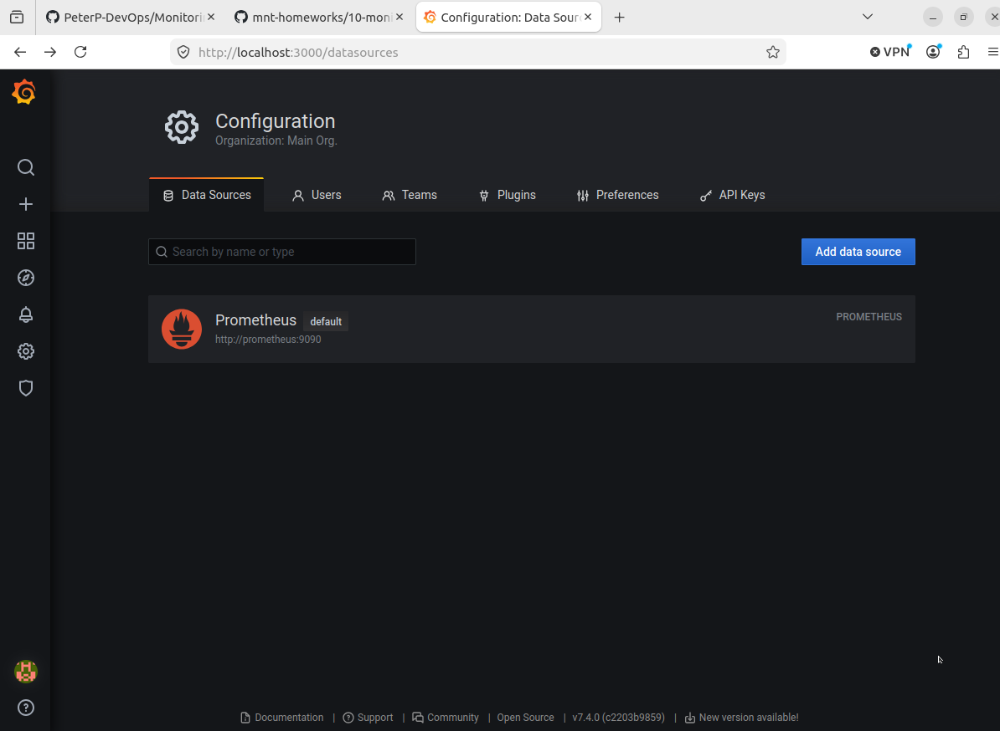
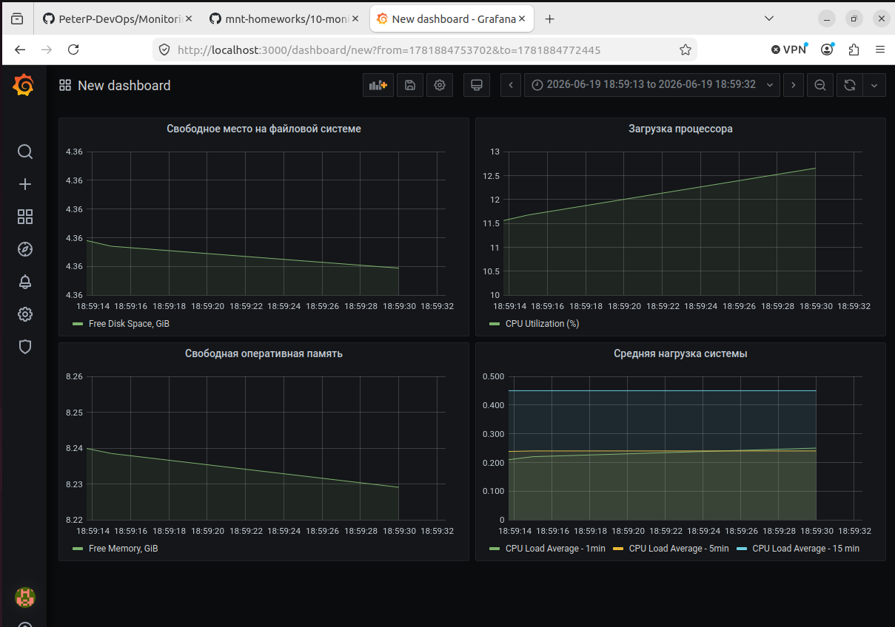
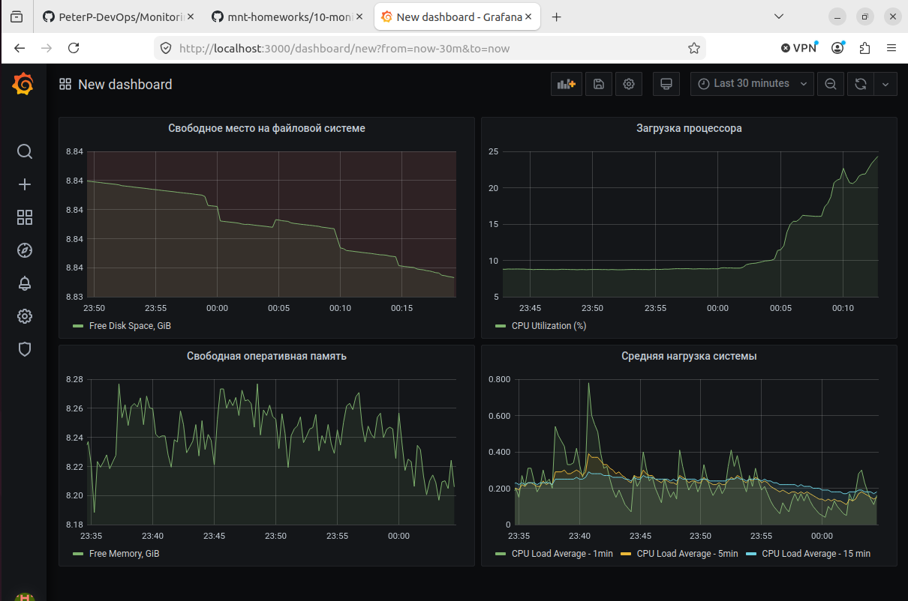

# Домашнее задание к занятию «Средство визуализации Grafana» - Петр Петров

### Задание 1
1. Используя директорию help внутри этого домашнего задания, запустите связку prometheus-grafana.
2. Зайдите в веб-интерфейс grafana, используя авторизационные данные, указанные в манифесте docker-compose.
3. Подключите поднятый вами prometheus, как источник данных.
4. Решение домашнего задания — скриншот веб-интерфейса grafana со списком подключенных Datasource.

### Решение 1




### Задание 2

Изучите самостоятельно ресурсы:

1. PromQL tutorial for beginners and humans.
2. Understanding Machine CPU usage.
3. Introduction to PromQL, the Prometheus query language.
Создайте Dashboard и в ней создайте Panels:

- утилизация CPU для nodeexporter (в процентах, 100-idle);
- CPULA 1/5/15;
- количество свободной оперативной памяти;
- количество места на файловой системе.
Для решения этого задания приведите promql-запросы для выдачи этих метрик, а также скриншот получившейся Dashboard.

### Решение 2

Cкриншот получившейся Dashboard



Promql-запросы для выдачи этих метрик:

- утилизация CPU для nodeexporter (в процентах, 100-idle):

```
100 - (avg by(instance) (
  rate(node_cpu_seconds_total{mode="idle"}[5m])
) * 100)

```

- CPULA 1/5/15

Load Average за 1 минуту - `node_load1`  
Load Average за 5 минут - `node_load5`  
Load Average за 15 минут - `node_load15`   

- количество свободной оперативной памяти;  

`node_memory_MemAvailable_bytes / 1024^3`

- количество места на файловой системе:  

`node_filesystem_avail_bytes{mountpoint="/"} / 1024 / 1024 / 1024`


### Задание 3
1. Создайте для каждой Dashboard подходящее правило alert — можно обратиться к первой лекции в блоке «Мониторинг».
2. В качестве решения задания приведите скриншот вашей итоговой Dashboard.

### Решение 3



### Задание 4

1. Сохраните ваш Dashboard.Для этого перейдите в настройки Dashboard, выберите в боковом меню «JSON MODEL». Далее скопируйте отображаемое json-содержимое в отдельный файл и сохраните его.
2. В качестве решения задания приведите листинг этого файла.

### Решение 4

[Листинг Dashbord](new_dashboard.json)  
